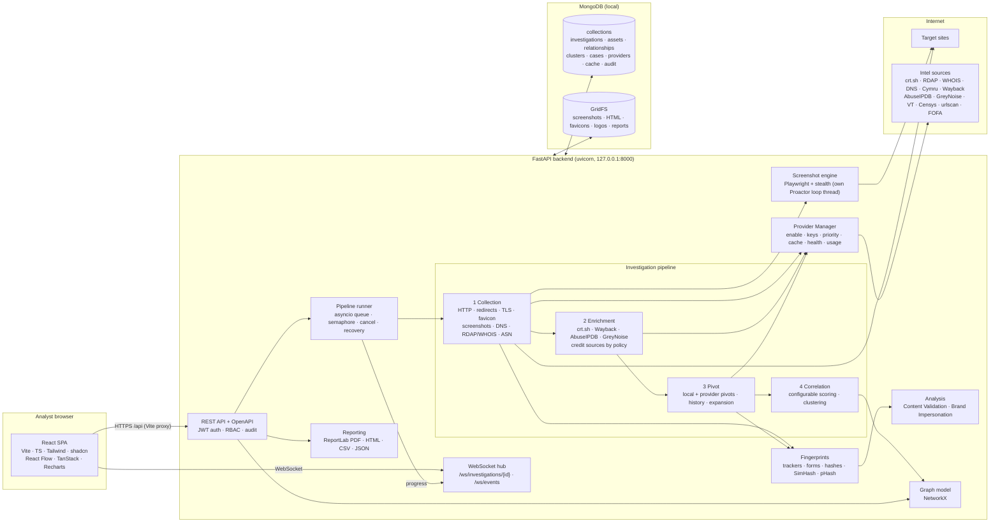

# TIM architecture

Threat Infrastructure Mapper is a local-first, single-host application. A FastAPI backend runs the investigation pipeline and serves the REST/WebSocket API. A React SPA (served by Vite in development) is the analyst UI. MongoDB with GridFS is the only datastore.

## System diagram

## Components

| Layer | Module | Responsibility |
|---|---|---|
| API | `app/api/routes/*` | REST endpoints. Every route declares its RBAC permission with `require(Permission.X)`. |
| Auth | `app/core/security.py`, `app/api/deps.py` | bcrypt password hashes, HS256 JWT, role → permission matrix, and Fernet encryption of provider API keys. |
| Pipeline | `app/pipeline/runner.py` | Queues investigations, bounds concurrency, runs the stages, records stage state and events, publishes progress, supports cancellation, and re-queues on restart. |
| Stages | `app/pipeline/stages/*` | `collection`, `enrichment`, `pivot`, `correlation` — each a `Stage.run(ctx)`. |
| Context | `app/pipeline/context.py` | Shared per-investigation state plus helpers to add assets, link edges, apply provider "related entities", and log progress. |
| Web profile | `app/pipeline/web_profile.py` | One reusable unit that fetches a URL and runs fingerprints, content validation, and brand analysis. The root IOC and every pivot candidate use the same code path. |
| Collectors | `app/collectors/*` | `web` (curl_cffi Chrome impersonation, manual redirects, meta-refresh, cookies per hop, SSRF guard), `tls` (X.509 parsing, trust check), `favicon`, `browser` (Playwright desktop/mobile/full-page/thumbnail). |
| Fingerprints | `app/fingerprints/*` | Website fingerprints (title, meta, forms, scripts, 10 tracker families, logos, DOM/text SimHash), image hashes (mmh3, MD5, SHA-256, pHash/aHash/dHash/wHash). |
| Analysis | `app/analysis/*` | Content Validation (ACTIVE/INACTIVE/PARKED/TAKEDOWN/ERROR), Brand Impersonation (two scores + indicators), and the Correlation engine. |
| Providers | `app/providers/*` | `BaseProvider` contract, 12 implementations, and the `ProviderManager` (config, keys, cache, health, usage, daily limits, pivots). |
| Graph | `app/graph/builder.py` | Builds a NetworkX `MultiDiGraph` from assets + relationships, then computes layout, degree centrality, components, and hubs in React Flow format. |
| Clusters | `app/services/clusters.py` | Per-investigation clustering, cross-investigation merge, and a global rebuild over distinctive fingerprints. |
| Reporting | `app/reporting/*` | Data assembly with an auto executive summary; PDF (ReportLab, vector graph), HTML (self-contained, CSP-locked), CSV (formula-injection safe), JSON. |

## Data model (MongoDB)

| Collection | Key fields |
|---|---|
| `investigations` | `ioc`, `ioc_type`, `normalized`, `status`, `options`, `stages{collection,enrichment,pivot,correlation}` (status/progress/events), `summary`, `root_asset_id`, `provider_runs[]`, `notes[]`, `cluster_ids`, `case_id` |
| `assets` | deterministic `_id = sha256(type\|value)[:24]`, `type`, `value`, `status`, `attributes` (web, tls, infrastructure, content, brand, website, screenshots…), `fingerprints` (indexed hashes and IDs), `enrichment.{provider}`, `confidence`, `correlation.{investigation_id}`, `cluster_ids`, `investigation_ids`, `sources`, `tags` |
| `relationships` | `_id = sha256(source\|type\|target)`, `source`, `target`, `type`, `weight`, `evidence[]` (last 20), `sources`, `investigation_ids` |
| `artifacts` + GridFS `files` | raw evidence: HTTP response, headers, cookies, redirect chain, HTML, rendered HTML, TLS, favicon, logos, screenshots, provider raw payloads, uploads, reports |
| `clusters` | `TIM-CL-YYYYMMDD-XXXXXX`, members, shared fingerprints, counts, screenshots, evidence, confidence, severity, notes |
| `cases` | `CASE-YYYY-NNNN`, linked assets/investigations/clusters, severity, status, tags, notes |
| `providers`, `provider_cache` (TTL index), `provider_usage` (daily) | provider config with encrypted keys, cached responses, usage counters |
| `settings` | scoring model, case counters |
| `audit_logs` | who did what, when, from where |

Asset IDs are deterministic, so pivots and edges can be written idempotently without lookups. Re-investigating the same infrastructure enriches the existing asset instead of duplicating it. This is how cross-investigation correlation emerges.

## Pipeline

1. **Collection.** Creates the root asset (and the host asset for URLs), then resolves DNS, RDAP, and WHOIS first so content validation can use NXDOMAIN and registry status. It then profiles the web page (HTTP + redirect chain + TLS + favicon + screenshots + fingerprints + analysis) and maps every public IP to an ASN and hosting provider with Team Cymru, RDAP, and PTR.
2. **Enrichment.** Runs the remaining free providers on the root, host, and the first IPs. Credit providers run only under the investigation's `credit_policy`: `never`, `when_needed` (fewer than 5 infrastructure assets or the site was unreachable), or `always`.
3. **Pivot.**
   - Exact local pivots on certificate, favicon, analytics, GTM, pixel, tracker, nameserver, and IP fingerprints. Values shared by more than 200 assets are skipped as common infrastructure.
   - Similarity pivots on HTML structure, screenshot, and logo.
   - Provider pivots: crt.sh certificate, FOFA favicon/cert/title/tracking-ID, urlscan favicon/title.
   - Historical screenshots and DNS.
   - Ranked expansion: the top N candidates get DNS, ASN, and a lightweight web profile.
4. **Correlation.** Builds the NetworkX graph and scores every host against the seeds. It then writes per-investigation evidence and creates or merges a threat cluster with `MEMBER_OF_CLUSTER` edges.

## Correlation scoring

Weights are configurable under **Settings → Scoring model** (`PUT /settings/scoring`). Defaults: analytics 40, GTM 40, pixel 40, other trackers 30, favicon 30, certificate 25, logo 25, HTML structure 20, screenshot 20, title 15, IP 10, ASN 5, nameserver 5, hosting 5, same redirect chain 35, subdomain of seed 30. Each feature counts once, and the total is capped at 100.

**Noise control:**
- Fingerprints shared by more assets than `noisy_fingerprint_limit` count at 25%.
- The same 25% applies to CDN ASNs (Cloudflare, Akamai, Fastly…) and to shared DNS providers.
- Generic titles ("Login", "404 Not Found", "Just a moment") are ignored.

**Confidence levels:** 90+ Very High · 70–89 High · 50–69 Medium · 30–49 Low · below 30 Informational. A host joins a cluster at `cluster_min` (default 50).

## Security model

- **Bind address and auth.** The API binds to `127.0.0.1` by default. Every endpoint except `/health`, `/metrics`, and `/auth/login` requires a JWT. Roles: `viewer` (read), `analyst` (investigate, cases, uploads, exports), `admin` (providers, keys, users, scoring, audit).
- **Login throttling.** 10 failures per user and IP within 15 minutes returns HTTP 429.
- **API keys.** Encrypted at rest with Fernet, keyed from `TIM_SECRET_KEY`. Only masked values are ever returned, and every change is audited.
- **SSRF guard.** Collection refuses targets that resolve to private, loopback, or link-local addresses, re-checking on every redirect hop. The headless browser aborts requests to literal internal hosts. Override with `TIM_ALLOW_PRIVATE_TARGETS=true` only for lab use.
- **Hostile content handling.**
  - Collected HTML and SVG are never served inline: they download as `application/octet-stream` with a sandboxing CSP.
  - HTML reports carry a strict CSP.
  - CSV exports neutralise formula injection.
- **Defanged input.** Accepted (`hxxp`, `[.]`) and normalised (IDNA, lower-case, scheme/port).
